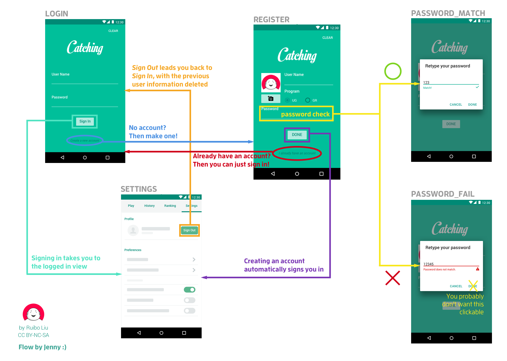

# 📱 Shaking Shiba -- CS65 Lab2

## 💻 General Info

### 📝 Assignment Description

In this lab, we present an application that connects to the internet to create an account and store data on the server.

For the server connectivity parts, we used the Volley library.

When you try to log in, `username` and `password` are required.

When you create an account, `username`,  `full_name`, and `password` are needed, with an option to upload an image.

Creating an account automatically signs you in, taking to the main activity which is consisted of 4 tabs.

The "settings" tab is the only one with features as of now. Other tabs have placeholders in them, and eventually we will fill them with content.

### 🐶 Team Shaking Shiba

 - Jenny Seong
 - Anja Subasic

### 🏠 Installation

  1. `git clone`
  2. open `android studio`
  3. open the project folder
  4. press the green triangle thingy (`Run`) on the top right ▶️
  5. wait for build and play around hoping that there are no bugs 🐛

## 🎨 Design Points

Here is the prompt given to us, with our own notations for better understanding:

Our app follows most points in the above mock, with a few differences that seemed reasonable to us.

#### 🌎 Log In Screen

We have a "Remember me" button that allows the user's input username and password to be saved when the user logs out. This feature is enabled by default when a new account is created.

#### 👩 Edge cases

According to our experiments and various sources such as https://perishablepress.com/stop-using-unsafe-characters-in-urls/, there are certain characters that will cause our HTTP query to go haywire because they serve as parsers.

In an attempt to prevent any confusion, we have blocked such characters from being input into the `username` and `password` fields.

#### ✅ Username and Password Check

We have a section right next to the `username` and `password` fields that visually notifies the user if the input username is available after checking with the server, and to notify if the password has been verified with the dialog that prompts the user to confirm their password entry.

According to these checks, the save button at the bottom of the screen will be enabled/disabled, making sure that the user has put in all the necessary data for creating an account.

#### 🚗 Signing In (Extra credit)

There are some complexities regarding the signing in--since everyone's assumptions are different, we will like to put out front that we pass in `username`, `password`, `full_name`, and `profile` image when signing up, and expect to get these values within successful logging in.

We retrieve the `full_name` that the user would have input at creation of the account, and carry the information onto the main activity. We assume there is a `full_name` field since we check for the validity of the inputs at sign up, as discussed in the previous section. This may not be the case for accounts made through different applications, so you may receive a "Parsing error" message even when the `GET` request returns a valid response.

Once the sign in request is made, we try two things with the response. 1) see if there are any errors 2) see if there is a JSON object with a `full_name` category. We also catch Volley errors. Thus, because we expect to get a `full_name` entry within signing in, the data will be displayed on the profile section of the settings tab.
