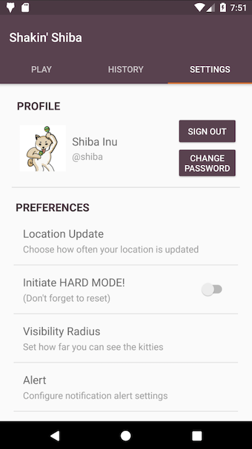

# 📱 Shaking Shiba -- CS65 Lab4

## 💻 General Info

### 📝 Assignment Description

In this lab, we culminate our programming skills and add content to the history tab, run foreground services and add camera overlay to the cat petting adventure.

For the server connectivity parts, we continued using the Volley library. Camera overlay was provided by Varun, the TA for this class. Some image loading was done through the Picasso library.

### Server Issues

In an attempt to handle server issues (mostly 500 errors), we have made some requests try themselves again 3 times before notifying the user that the server is experiencing issues. This greatly reduced the number of error messages being shown.

### 📱 App Flow

When you try to log in, `username` and `password` are required.

When you create an account, `username`,  `full_name`, and `password` are needed, with an option to upload an image.

Creating an account automatically signs you in, taking to the main activity which is consisted of 3 tabs.

After logging in, additional information from server will be put into the settings. Once they are loaded, you will be able to change them accordingly in your local device. The changed settings are saved to the server *upon singing out*. You can also *change your password* in the settings page.

The main game lives in the Play tab. Once you click the action button, a `MapActivity` is launched where you can see markers of cat locations and your location to start moving and collecting cats.

The History tab hosts the list of cats in the current game. The full list of cats, with their name, location (in longitude and latitude), and whether they have been petted or not will be shown.

### 🏠 Installation

  1. `git clone`
  2. open `android studio`
  3. open the project folder (`Lab 3`)
  4. press the green triangle thingy (`Run`) on the top right ▶️
  5. wait for build and play around hoping that there are no bugs 🐛
      (don't worry, we checked)

We have also included an `APK` file of the application. Download the `APK` on your device and run it to install the app.

### 🙏 Permissions

The app asks for these permissions:

1. `INTERNET`: for connecting to the server
2. `CAMERA`: for taking a profile image
3. `STORAGE`: for storing photos and data
4. `LOCATION`: for playing the location-based game

### :book: Libraries

1. Android crop: https://github.com/jdamcd/android-crop
2. Volley: https://github.com/google/volley
3. Camera Overlay: https://github.com/mishravarun/camera-overlay-demo
4. Picasso: http://square.github.io/picasso/

## 🎨 Design Points

Our app follows most points in the mockups shown in the App Flow section above, with a few differences that seemed reasonable to us.

### 🙋 Sign-in and Register Account Pages

#### ✋ Log In Screen

We have a "Remember me" button that allows the user's input username and password to be saved when the user logs out. This feature is enabled by default when a new account is created.

**UPDATE**: In the case that the user's password has been changed (from a different device, presumably), the app will automatically log the user out and redirect to the log in page.

#### 🧀 Edge cases

According to our experiments and various sources such as [this](https://perishablepress.com/stop-using-unsafe-characters-in-urls/), there are certain characters that will cause our HTTP query to go haywire because they serve as parsers. We have blocked such characters from being input into the `username` and `password` fields.

#### ✅ Username and Password Check

We have a section right next to the `username` and `password` fields that visually notifies the user if the input username is available after checking with the server, and to notify if the password has been verified with the dialog that prompts the user to confirm their password entry.

#### 🚗 Signing In

When the login response is returned, we save the response as a `String` and move onto the `MainActivity` and parse it later. We do this instead of parsing the data at login because different account made from different applications will have different `key` names for the JSON Object.

For example, we pass in `username`, `password`, `full_name`, and `profile` image when signing up, and expect to get these values within successful logging in. But someone else might have `fullname` or `name_full` as the key. This gets even more complex when additional information such as the settings options come into play.

You may receive a "Parsing error" message even when the `GET` request returns a valid response. We tried to catch all the "unable to parse JSON" exceptions, but please let us know if you find any.

### 🐈 Play Tab

#### ♻️ Reset Cat List

You can *reset* the cat list from within the app! Maybe you want to re-pet a cat (you might need to reset a few times since the cat might not want to pop up) or want to have a fresh start. Or maybe you're a master collector and have collected 👏all👏 👏the👏 👏cats.👏

**UPDATE**: The reset button has been moved from the Settings tab to the Play tab.

#### 🌎 Auto-Zoom in Map

Although it was given in the rubric that we should "Update and zoom to your location on the map in real time," we concluded that this greatly interfered with the playability of the game.

We start off with a zoom where you can see around `200m` around your location. This is a comfortable scale to start the game and have a rough idea of where to go next.

But when you start looking for cats, you may want to zoom in more. This is especially true when there are two or more cats in *roughly the same location*. If we try to zoom back to whatever is set as the default zoom, the player's efforts to play the game will go to waste!

Thus, we decided to follow the user and update the camera center, but **not** the zoom.  

#### 📏 Distance Calculation

The distance from a selected cat is calculated using the `Location.distanceTo` function in the `Location` class. This method returns the distance between one location to the destination location.

We noticed that the value being returned from this method tended to differ from what the server returned to us when we tried to `Pet` the selected cat. We couldn't figure out what was wrong, and tried using different methods such as `Location.distanceBetween`, but it was still a little (or sometimes quite a lot) off.

**UPDATE**: It has been noted by Sergey that there is an error in the library being used by the server.

#### 🗺 **NEW!!** Tracking

The app now has a tracking feature. Select a cat on the map, click the track button, and the service will run in the foreground to keep track of the user's distance from the selected cat.

Clicking on the notification will automatically open the application in the Map page, with the tracked cat selected.

Tracking is automatically cancelled when the user signs out or the user resets the list.

#### 📷 Camera Overlay

When the `Pet` button is clicked, the camera overlay will be launched. You will only be able to see the cat if you are within the range of 10m from the cat.

Once the user sees the cat, they can click on the cat to pet it, which sends the pet request. If the user is too far, they will be notified so and the current distance from the cat will be given.

#### 🎁 Success Activity  

Upon successful petting of the cat, a screen pops up saying you have befriended a cat. There are two buttons in this screen:  

1. `AGAIN`: takes you back to the `MapActivity`, so you can go find more cats!  

2. `DONE`: takes you to `MainActivity`'s tabbed view, so you can stop playing or go to the settings tab to change your preferences or reset the list etc.  

**NOTE**: There is, in fact, another *hidden button* in this screen. What is it? Click around to find out... 😏 

### ⏳ History Tab

The history tab gets the full list of cats from the server for the current game that the user is playing. Thus, the list will be reset whenever the user decides to reset the cat list.

Each list item has the following:
- Image of the cat
- Name of the cat
- Cat's location (longitude and latitude)
- Whether the cat has been pet

The last item, whether the cat has been pet, is indicated by a handy icon at the right end of the list. It will be grey if the user has not interacted with the cat yet, and colors will be filled if the user has interacted with the cat.

In order to make sure that the most current list is displayed, we made the app call the server every time the History tab is selected. Due to the recent server issues, it may show some error messages throughout the gameplay.

Click the cats to say hi to them!

### ⚙️ Settings Tab

#### 🚶 Sign Out

Signing out sends a `POST` request to the server to update any changes in the settings. This allows you to have your settings across devices, if you sign in with the same `username` and `password`.

Signing out will also stop whatever tracking service was running.

#### ⏰ Location Update Frequency

You can change how often your location gets updated. Remember, the map will move back to your location according to this frequency, so if you feel like this feature is a little annoying, try having the location update less often.

#### 🔥 Toggle Hard Mode

Toggling this option on will make the getting the cat list request (`catlist.pl`) go out with a `mode=hard` tag. You will need to reset the list before going back to the game to make sure the list is updated.

#### 👀 Visibility Radius

Changing the settings in this menu will determine how far you can see the cats on the map. When a selected cat goes out of this visibility radius, the information panel in the game screen will be reset to the placeholder information, prompting the user to click on a marker.

#### ⚠️ Notification Settings

The notification settings allows the user to choose how to be notified via a notification. This could be a sound, vibration, both, or none. *Hmm, I wonder what the notification sound is?*

## Credits 🐶 Team Shaking Shiba

 - Jenny Seong
 - Anja Subasic
